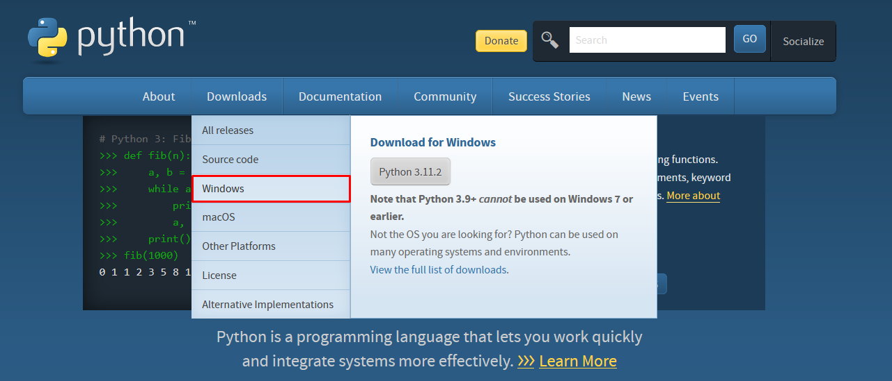
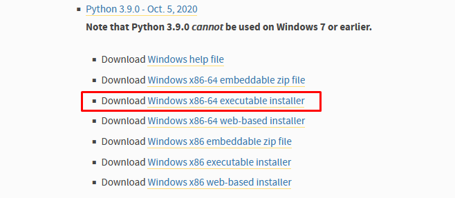
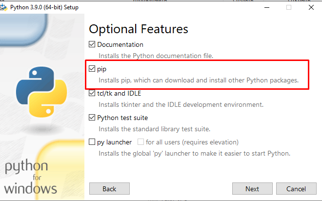

# Описание:
Учебный проект выполненный в рамках спринта № 9 "API для Yatube".

# Язык проекта: :snake:
```
Python - 3.9.0
```
# WEB-фреймворк: :globe_with_meridians:
```
Django - 3.2.16
```
# API-фреймворк: :dna:
```
Django REST framework - 3.12.4
```
# Требования:
Для успешной работы проекта необходимо выполнить следующие требования:

- Интерпретатор Python:
 
  __Установка интерпретатора для Windows 10 и выше__
  
  Зайдите на [официальный сайт Python](https://www.python.org/) и в меню `Downloads` выбираем операционную систему Windows.

    

    Из списка выбираем необходимую версию интерпретатора и файл инсталятора.
    

    При установке интерпретатора автоматически будет установлен `пакетный менеджер pip`, он нужен для установки модулей и библиотек Python.

    

  __Установка интерпретатора для для Linux (Ubuntu)__

  Откройте программу "Терминал", её можно вызвать нажав сочетание клавиш `CTRL+ALT+T`.

  В операционной системе Ubuntu по умолчанию уже установлен интерпретатор Python. Чтобы узнать версию, которая установлена у вас, используйте команду:
  ```
  python3 --version
  ```
  Если текущая версия 3.9, у вас всё готово к работе. Если нет, нужно её установить.
  Будем следовать такому плану:
  - Обновим пакеты системы.
  - Установим нужную версию Python.
  - Убедимся, что установка прошла успешно.
  Чтобы обновить пакеты системы, нужно использовать пакетный менеджер `apt`.
  Введите в терминал команду:
  ```
  sudo apt update && sudo apt upgrade 
  ```
  Далее можно запускать установку нужной версии Python и пакетов для неё.

  Выполните последовательно команды:
  ```
  sudo apt install python3.9 -y
  sudo apt install python3.9-venv
  ```
  Убедитесь, что установка версии 3.9 прошла успешно.
   
  Выполните команду:
  ```
  python3.9 --version 
  ```
  В терминал должна вывестись версия Python, которую вы только что установили.

  Версия, которая была установлена в системе по умолчанию, по-прежнему будет доступна.
   
  Для её вызова можно ввести команду:
  ```
  python3 --version
  ```
- Установка Git:

  __Установка Git для операционной системы Windows__

  Для пользователям Windows рекомендоую установить приложение `Git Bash`, которое поддерживает необходимую систему команд для решения задач в проекте.

  [Скачайте](https://gitforwindows.org/) установочный файл приложения и запустите его. В процессе установки оставьте все настройки по умолчанию.

  __Установка Git для для Linux (Ubuntu)__

  Git, вероятнее всего, уже установлен на вашей опереционной системе.
   
  Это можно проверить выполнив команду:
  ```
  git --version
  ```
  Однако если вы не получили вывод с номером версии Git, его можно установить с помощью диспетчера пакетов APT по умолчанию в Ubuntu.
   
  Сперва обновим локальный индекс пакетов:
  ```
  sudo apt update
  ```
  После завершения обновления выполняем установку Git:
  ```
  sudo apt install git
  ```
  Проверяем наличие Git:
  ```
  git --version
  ```
  Если всё сделано правильно в выводе будет отображена версия Git:
  ```
  git version 2.25.1
  ```

# Установка: 
- Клонируйте репозиторий:
    ```
    git clone https://github.com/V01ant/api_final_yatube.git
    ```
- Создание виртуального окружения

    В терминале передите в папку проекта и выполните команду:

    __Для Windows__
    ```
    python -m venv venv
    ```
    __Для Linux__
    ```
    python3 -m venv venv
    ```

    После выполнения этой команды в директории проекта появится папка venv (от `virtual environment`, «виртуальное окружение»), в ней хранятся служебные файлы.


- Активация виртуального окружения

    Находясь в корневой директории проекта first_project, введите в терминал команду:

    __Для Windows__
    ```
    source venv/Scripts/activate
    ```
    __Для Linux__
    ```
    source venv/bin/activate
    ```

    После активации виртуального окружения в терминале появится уведомление, что вы работаете в виртуальном окружении: все команды будет предварять строка (`venv`):
    ```
    (venv)...$
    ```

    Виртуальное окружение для проекта first_project запущено! Теперь все команды, которые вы введёте в терминал, будут выполняться в этом окружении.

    Деактивировать виртуальное окружение можно командой:
    ```
    (venv)...$ deactivate 
    ```
- Установка зависимостей из файла:

    Пакетный менеджер построчно считает файл `requirements.txt` зависимостей и установит указанные в нём библиотеки.

    Для этого выполните команду:
    ```
    pip install -r requirements.txt
    ```
    Запустите проект:
    ```
    python manage.py runserver
    ```


# Примеры запросов к API:
Для просмотра списока еднпоинтов выполните `GET-запрос` к адресу:
```
http://127.0.0.1:8000/api/
```
Ответ:
```
{
    "v1/posts": "http://127.0.0.1:8000/api/v1/posts/",
    "v1/groups": "http://127.0.0.1:8000/api/v1/groups/",
    "v1/follow": "http://127.0.0.1:8000/api/v1/follow/"
}
```
Для добавления подписки на автора выполните `POST-запрос` к эндпоинту:
```
http://127.0.0.1:8000/api/v1/follow/
```
Данные передаваемые в запросе.
```
{
    "following": "user2"
}
```
Ответ:
```
{
    "id": 1,
    "user": "user1",
    "following": "user2"
}
```
Для получения списка подписок выполните `GET-запрос` к эндпоинту:
```
http://127.0.0.1:8000/api/v1/follow/
```
Ответ:
```
[
    {
        "id": 1,
        "user": "user1",
        "following": "user2"
    },
    {
        "id": 2,
        "user": "user1",
        "following": "user3"
    }
]
```
Для получения списка групп выполните `GET-запрос` к еднпоинту:
```
http://127.0.0.1:8000/api/v1/groups/
```
Ответ:
```
[
    {
        "id": 1,
        "title": "Группа1",
        "slug": "group1",
        "description": "Тестовая группа 1"
    },
    {
        "id": 2,
        "title": "Группа 2",
        "slug": "group2",
        "description": "Тестовая группа 2"
    }
]
```
Для получения списка постов выполните `GET-запрос` к эндпоинту:
```
http://127.0.0.1:8000/api/v1/posts/
```
Ответ:
```
[
    {
        "id": 1,
        "author": "user1",
        "text": "Пост номер 1",
        "pub_date": "2023-02-12T18:21:55.612533Z",
        "image": null,
        "group": 1
    },
    {
        "id": 2,
        "author": "user1",
        "text": "Пост номер 2",
        "pub_date": "2023-02-12T18:22:31.161151Z",
        "image": null,
        "group": 1
    }
]
```
Для получения одного поста отправьте `GET-запрос` добавив в конец `ULR` id поста:
```
http://127.0.0.1:8000/api/v1/posts/1
```
Ответ:
```
{
    "id": 1,
    "author": "user1",
    "text": "Пост номер 1",
    "pub_date": "2023-02-12T18:21:55.612533Z",
    "image": null,
    "group": 1
}
```